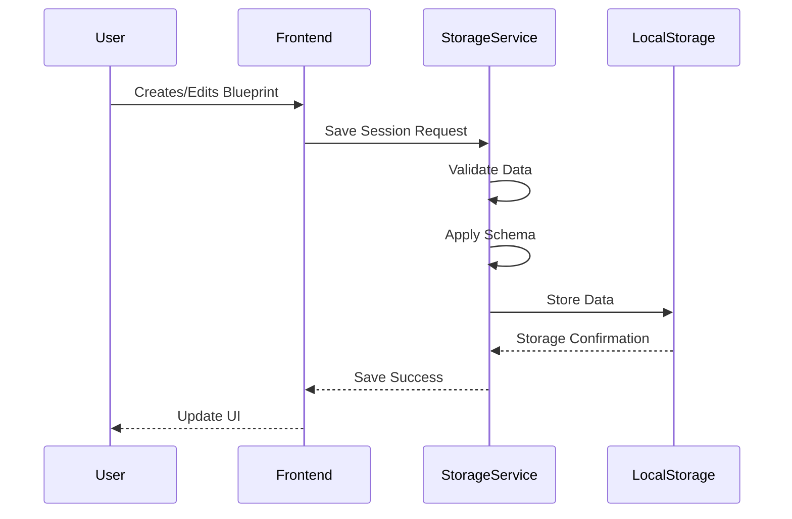
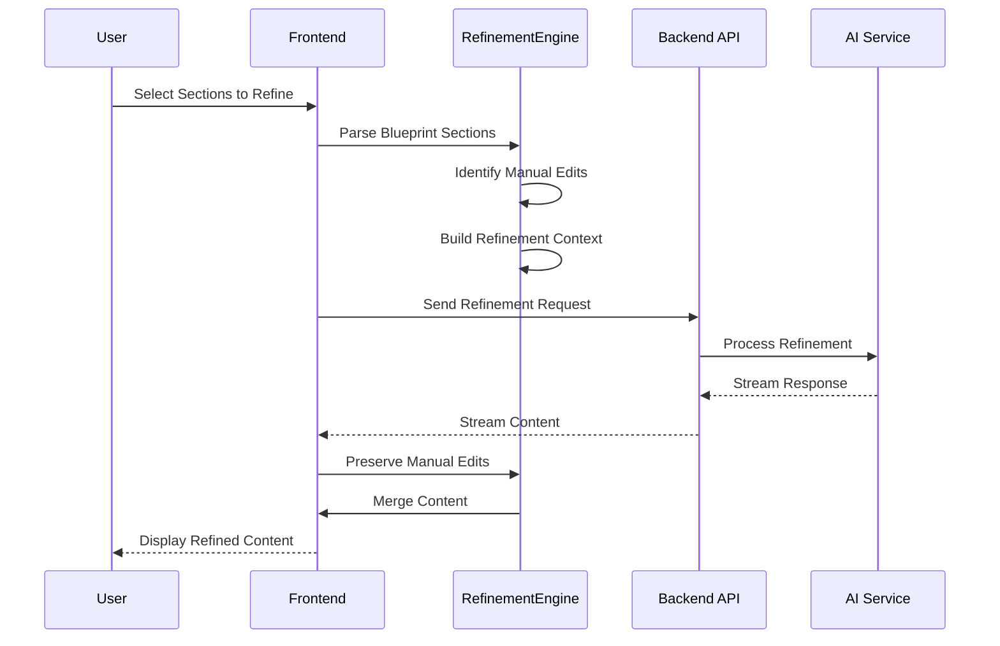

# M2 Technical Approach Document

## Overview

This document outlines the technical approach for M2 (Refinement & Persistence Phase) of the Blueprintify project, building upon the M1 foundation to deliver advanced editing, persistence, and refinement capabilities.

## M2 Objectives

### Primary Goals

1. **Blueprint Persistence**: Implement localStorage-based persistence for blueprints
2. **Manual Editing**: Enable manual editing of generated content in split-pane view
3. **Refinement Workflow**: Create workflow for selective content regeneration
4. **Export/Import**: Add data portability through export/import functionality

### Success Criteria

- [ ] Blueprints persist across browser sessions
- [ ] Users can edit generated content with live preview
- [ ] Refinement workflow allows selective section regeneration
- [ ] Export/import functionality supports data portability
- [ ] All M2 features integrate seamlessly with M1 foundation

## Technical Architecture

### System Architecture Overview

```mermaid
graph TD
    A[Frontend - React App] --> B[State Management - Zustand]
    A --> C[Storage Service - LocalStorage]
    A --> D[Editor Component - CodeMirror]
    A --> E[Refinement Engine]

    B --> F[Wizard State]
    B --> G[Session State]
    B --> H[Editor State]
    B --> I[Refinement State]

    C --> J[Session Persistence]
    C --> K[Settings Storage]
    C --> L[Cache Management]

    D --> M[Split-Pane Editor]
    D --> N[Markdown Preview]
    D --> O[Syntax Highlighting]

    E --> P[Section Parser]
    E --> Q[Context Builder]
    E --> R[Edit Preserver]
    E --> S[Undo/Redo System]

    T[Backend - Hono API] --> U[Generation Endpoint]
    T --> V[Refinement Endpoint]
    T --> W[Export Endpoint]
    T --> X[Import Endpoint]

    A --> T
```

### Component Architecture

#### Frontend Components

1. **Storage Layer**
   - `LocalStorageService`: Core storage operations
   - `SessionManager`: Session CRUD operations
   - `SettingsManager`: User settings management
   - `CacheManager`: Performance optimization

2. **Editor Layer**
   - `SplitPaneEditor`: Main editor component
   - `CodeMirrorEditor`: Code editor integration
   - `MarkdownPreview`: Live preview component
   - `EditorToolbar`: Editor controls and actions

3. **Refinement Layer**
   - `SectionSelector`: Section selection interface
   - `RefinementPanel`: Refinement controls
   - `StreamingDisplay`: Real-time refinement display
   - `EditHighlighter`: Manual edit highlighting

4. **Export/Import Layer**
   - `ExportDialog`: Export options and format selection
   - `ImportDialog`: Import validation and preview
   - `ConflictResolver`: Import conflict resolution
   - `ProgressIndicator\*\*: Operation progress display

#### Backend Components

1. **API Endpoints**
   - `/refine`: Content refinement endpoint
   - `/export`: Data export endpoint
   - `/import`: Data import endpoint
   - `/validate`: Import validation endpoint

2. **Processing Layer**
   - `RefinementEngine`: Core refinement logic
   - `SectionParser`: Blueprint section parsing
   - `ContextBuilder`: Refinement context assembly
   - `ExportProcessor`: Export format processing

### Data Flow Architecture

#### Persistence Flow

#### Refinement Flow

## Implementation Strategy

### Phase 1: Storage Foundation (Issue #105)

#### Priority: High

#### Estimated Effort: 6-8 hours

**Key Tasks:**

1. Implement localStorage schema and service
2. Create session management system
3. Add auto-save functionality
4. Implement storage quota management
5. Add migration strategy for schema changes

**Technical Implementation:**

- Use TypeScript interfaces for type safety
- Implement Zod validation for schema compliance
- Add error handling for storage failures
- Create backup mechanisms for data recovery
- Implement performance optimizations (lazy loading, caching)

**Integration Points:**

- Wizard state management (Zustand store)
- Session lifecycle management
- Settings and preferences system
- Error boundary integration

### Phase 2: Manual Editing (Issue #99)

#### Priority: High

#### Estimated Effort: 4-6 hours

**Key Tasks:**

1. Integrate CodeMirror editor in split-pane view
2. Implement live markdown preview
3. Add edit state tracking and persistence
4. Create editor toolbar and controls
5. Implement syntax highlighting and themes

**Technical Implementation:**

- Use @uiw/react-codemirror for React integration
- Implement custom markdown extensions
- Add real-time preview synchronization
- Create undo/redo functionality
- Implement auto-save for edited content

**Integration Points:**

- Split-pane layout component
- Session persistence system
- Settings management (editor preferences)
- Export functionality integration

### Phase 3: Refinement Workflow (Issue #100)

#### Priority: High

#### Estimated Effort: 8-10 hours

**Key Tasks:**

1. Implement blueprint section parser
2. Create section selection interface
3. Build refinement context system
4. Implement edit preservation logic
5. Add streaming refinement display
6. Create undo/redo system for refinements

**Technical Implementation:**

- Use regex-based parsing for section identification
- Implement context-aware refinement requests
- Create edit detection and preservation algorithms
- Add real-time streaming with SSE
- Implement comprehensive change tracking

**Integration Points:**

- Backend refinement endpoint
- Editor component integration
- Storage system for refinement history
- Export/import functionality

### Phase 4: Export/Import (Issue #101)

#### Priority: High

#### Estimated Effort: 6-8 hours

**Key Tasks:**

1. Implement JSON export format
2. Create ZIP archive export
3. Add import validation and preview
4. Implement conflict resolution system
5. Create migration and compatibility handling

**Technical Implementation:**

- Use JSZip for archive creation
- Implement comprehensive schema validation
- Create conflict detection and resolution algorithms
- Add migration path support
- Implement progress tracking for large operations

**Integration Points:**

- Storage system for data access
- File system integration for downloads
- Settings for export preferences
- Validation system integration

## Technical Specifications

### Storage Specifications

#### Schema Design

- **Version**: 1.0.0 with semantic versioning
- **Format**: JSON with Zod validation
- **Compression**: Optional LZ-string compression for large content
- **Migration**: Automatic schema migration support

#### Performance Requirements

- **Storage Limit**: Keep under 2MB total usage
- **Load Time**: <100ms for session loading
- **Save Time**: <50ms for session saving
- **Cache Hit Rate**: >90% for frequently accessed sessions

### Editor Specifications

#### CodeMirror Configuration

- **Extensions**: Markdown, syntax highlighting
- **Themes**: Light/dark theme support
- **Features**: Line numbers, word wrap, search/replace
- **Performance**: <16ms render time for typical content

#### Preview Specifications

- **Renderer**: React-markdown with custom components
- **Features**: Syntax highlighting, table rendering, math support
- **Performance**: <50ms render time for typical content
- **Sync**: <100ms sync time between editor and preview

### Refinement Specifications

#### Section Parsing

- **Algorithm**: Regex-based with markdown awareness
- **Accuracy**: >95% section identification accuracy
- **Performance**: <200ms parsing time for typical blueprints
- **Types**: Support for all standard markdown sections

#### Edit Preservation

- **Detection**: >90% manual edit detection accuracy
- **Preservation**: >95% successful edit preservation rate
- **Merge**: Intelligent merge strategies for different edit types
- **Performance**: <300ms total preservation processing time

### Export/Import Specifications

#### Format Support

- **JSON**: Primary format with full metadata
- **ZIP**: Archive format with multiple files
- **Markdown**: Human-readable format option
- **Compatibility**: Support for schema version migration

#### Performance Requirements

- **Export**: <2 seconds for typical session export
- **Import**: <3 seconds for typical session import
- **Validation**: <500ms for import validation
- **File Size**: Support up to 10MB import files

## Integration Strategy

### M1 Integration

#### Existing Components

- **Wizard Flow**: Integrate with session persistence
- **Generation Flow**: Connect to refinement workflow
- **Split-Pane Layout**: Enhance with editing capabilities
- **State Management**: Extend with new state types

#### Migration Strategy

- **Backward Compatibility**: Maintain M1 functionality
- **Data Migration**: Automatic migration of existing data
- **Feature Flags**: Optional M2 features for gradual rollout
- **Testing**: Comprehensive integration testing

### Third-Party Integration

#### Dependencies

- **CodeMirror**: @uiw/react-codemirror for editing
- **JSZip**: jszip for archive creation
- **Compression**: lz-string for data compression
- **Validation**: Zod for schema validation

#### API Integration

- **OpenAI API**: Enhanced prompts for refinement
- **Browser APIs**: LocalStorage, File API, Download API
- **Performance APIs**: Performance monitoring and optimization

## Quality Assurance

### Testing Strategy

#### Unit Testing

- **Storage Service**: All CRUD operations and error scenarios
- **Editor Component**: User interactions and state management
- **Refinement Engine**: Section parsing and edit preservation
- **Export/Import**: Format validation and data integrity

#### Integration Testing

- **End-to-End Workflows**: Complete user journey testing
- **Cross-Browser Testing**: Chrome, Firefox, Safari compatibility
- **Performance Testing**: Load testing and optimization validation
- **Error Handling**: Comprehensive error scenario testing

#### User Acceptance Testing

- **Usability Testing**: User interface and workflow validation
- **Feature Testing**: All M2 features functionality verification
- **Compatibility Testing**: Data import/export compatibility
- **Migration Testing**: Schema migration and data integrity

### Code Quality

#### Standards

- **TypeScript**: Strict mode with comprehensive type coverage
- **ESLint**: Custom rules for project-specific standards
- **Prettier**: Consistent code formatting
- **Husky**: Pre-commit hooks for quality assurance

#### Documentation

- **Code Comments**: Comprehensive inline documentation
- **API Documentation**: Complete API reference documentation
- **User Documentation**: User guides and tutorials
- **Technical Documentation**: Architecture and implementation docs

## Performance Optimization

### Frontend Optimization

#### Code Splitting

- **Route-Based**: Split by application routes
- **Feature-Based**: Split by M2 features
- **Vendor**: Separate third-party dependencies
- **Lazy Loading**: Load components on demand

#### State Management

- **Normalization**: Efficient state structure
- **Memoization**: React.memo and useMemo usage
- **Debouncing**: User input debouncing
- **Cleanup**: Proper cleanup and memory management

### Storage Optimization

#### Data Compression

- **Text Compression**: LZ-string for content compression
- **Schema Optimization**: Efficient data structure design
- **Cache Strategy**: Intelligent caching for frequently accessed data
- **Cleanup**: Automatic cleanup of old/archived data

#### Performance Monitoring

- **Storage Metrics**: Real-time storage usage monitoring
- **Performance Metrics**: Operation timing and optimization
- **Error Tracking**: Comprehensive error monitoring
- **User Analytics**: Usage pattern analysis

## Security Considerations

### Data Protection

#### Input Validation

- **Schema Validation**: Zod validation for all inputs
- **Content Sanitization**: Sanitize all user-generated content
- **File Validation**: Validate imported files and assets
- **Size Limits**: Enforce reasonable size limits

#### Storage Security

- **Data Encryption**: Optional client-side encryption
- **Privacy Mode**: Disable persistence in privacy mode
- **Secure Storage**: Secure localStorage practices
- **Data Minimization**: Store only necessary data

### Privacy Considerations

#### User Privacy

- **Local Storage**: Data stored locally only
- **No Tracking**: No user behavior tracking
- **Data Control**: User control over data storage
- **Transparent Policies**: Clear privacy policies

#### Data Handling

- **Sensitive Data**: No storage of sensitive information
- **Data Retention**: User-controlled data retention
- **Export Rights**: User right to export data
- **Deletion Rights**: User right to delete data

## Deployment Strategy

### Release Planning

#### Feature Flags

- **M2 Features**: Optional feature flags for gradual rollout
- **A/B Testing**: Controlled feature testing
- **Rollback**: Quick rollback capability
- **Monitoring**: Real-time feature monitoring

#### Migration Strategy

- **Data Migration**: Automatic data migration
- **Backward Compatibility**: Maintain M1 compatibility
- **User Communication**: Clear release communication
- **Support**: Comprehensive user support

### Monitoring and Maintenance

#### Performance Monitoring

- **Application Performance**: Real-time performance monitoring
- **User Experience**: User experience metrics
- **Error Tracking**: Comprehensive error monitoring
- **Usage Analytics**: Feature usage analytics

#### Maintenance Strategy

- **Regular Updates**: Scheduled maintenance and updates
- **Bug Fixes**: Prompt bug resolution
- **Feature Enhancement**: Continuous feature improvement
- **User Feedback**: Active user feedback incorporation

## Risk Assessment

### Technical Risks

#### Storage Limitations

- **Risk**: Browser localStorage quota limitations
- **Mitigation**: Intelligent storage management and cleanup
- **Contingency**: Alternative storage strategies

#### Performance Issues

- **Risk**: Performance degradation with large blueprints
- **Mitigation**: Lazy loading and optimization strategies
- **Contingency**: Performance fallback mechanisms

#### Browser Compatibility

- **Risk**: Cross-browser compatibility issues
- **Mitigation**: Comprehensive testing and polyfills
- **Contingency**: Graceful degradation strategies

### User Experience Risks

#### Complexity

- **Risk**: Increased complexity may overwhelm users
- **Mitigation**: Intuitive UI design and progressive disclosure
- **Contingency**: Simplified mode option

#### Data Loss

- **Risk**: Potential data loss during migration
- **Mitigation**: Comprehensive backup and recovery mechanisms
- **Contingency**: Data recovery support

## Success Metrics

### Technical Metrics

#### Performance Metrics

- **Load Time**: <2 seconds for application load
- **Save Time**: <500ms for session save operations
- **Export Time**: <2 seconds for typical exports
- **Import Time**: <3 seconds for typical imports

#### Quality Metrics

- **Bug Rate**: <5 critical bugs per release
- **Test Coverage**: >90% code coverage
- **Performance**: <5% performance regression
- **Compatibility**: >95% cross-browser compatibility

### User Experience Metrics

#### Usage Metrics

- **Feature Adoption**: >70% M2 feature adoption rate
- **User Retention**: >80% user retention rate
- **Task Completion**: >90% task completion rate
- **User Satisfaction**: >4.5/5 user satisfaction rating

#### Engagement Metrics

- **Session Duration**: >10 minutes average session
- **Edit Frequency**: >5 edits per session
- **Export Usage**: >30% users use export feature
- **Refinement Usage**: >40% users use refinement feature

## Future Roadmap

### M3 Planning

#### Advanced Features

- **Collaboration**: Multi-user collaboration features
- **Cloud Sync**: Optional cloud synchronization
- **AI Enhancement**: Advanced AI-powered features
- **Templates**: Enhanced template system

#### Platform Expansion

- **Mobile**: Mobile application development
- **Desktop**: Desktop application development
- **API**: Public API for third-party integration
- **Plugins**: Plugin system for extensibility

### Long-term Vision

#### Ecosystem Development

- **Community**: User community development
- **Marketplace**: Template and plugin marketplace
- **Integration**: Third-party tool integration
- **Enterprise**: Enterprise feature development

## Conclusion

The M2 technical approach provides a comprehensive foundation for implementing advanced editing, persistence, and refinement capabilities in the Blueprintify application. The phased implementation strategy ensures manageable development cycles while maintaining high quality and user experience standards.

The architecture is designed to be scalable, maintainable, and extensible, providing a solid foundation for future enhancements and platform expansion. With proper execution of this technical approach, M2 will significantly enhance the value and utility of the Blueprintify application.
