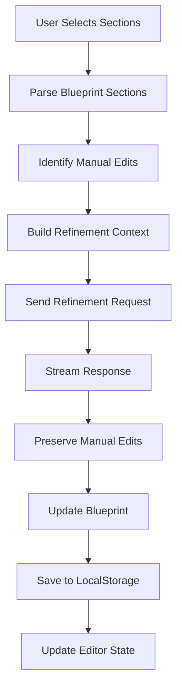

# Blueprint Refinement Workflow Architecture

## Overview

This document defines the architecture for the blueprint refinement workflow, enabling users to selectively regenerate and refine sections of their blueprints while preserving manual edits.

## Workflow Architecture

### Core Components

1. **Section Parser**: Identifies and parses blueprint sections
2. **Refinement Engine**: Manages the refinement process
3. **Context Manager**: Maintains context during refinement
4. **Edit Preserver**: Preserves manual edits during regeneration
5. **Undo/Redo System**: Manages change history

### Section Identification

```typescript
interface BlueprintSection {
  id: string; // Unique section identifier
  type: SectionType; // Section type (header, content, code, etc.)
  title: string; // Section title/heading
  content: string; // Section content
  startPosition: number; // Start position in blueprint
  endPosition: number; // End position in blueprint
  isManualEdit: boolean; // Flag for manual edits
  dependencies: string[]; // Dependencies on other sections
  metadata: SectionMetadata; // Additional section metadata
}

enum SectionType {
  HEADER = "header",
  INTRODUCTION = "introduction",
  ARCHITECTURE = "architecture",
  FEATURES = "features",
  TECH_STACK = "tech-stack",
  IMPLEMENTATION = "implementation",
  TESTING = "testing",
  DEPLOYMENT = "deployment",
  CONCLUSION = "conclusion",
  CODE_BLOCK = "code-block",
  LIST = "list",
  TABLE = "table",
}
```

### Refinement Request Structure

```typescript
interface RefinementRequest {
  sessionId: string; // Session identifier
  sectionIds: string[]; // Sections to refine
  refinementType: RefinementType; // Type of refinement
  context: RefinementContext; // Context for refinement
  preserveEdits: boolean; // Preserve manual edits flag
  options: RefinementOptions; // Additional options
}

enum RefinementType {
  REGENERATE = "regenerate", // Complete regeneration
  ENHANCE = "enhance", // Enhance existing content
  EXPAND = "expand", // Add more detail
  SIMPLIFY = "simplify", // Simplify content
  FIX = "fix", // Fix issues/bugs
  CUSTOM = "custom", // Custom refinement prompt
}

interface RefinementContext {
  wizardState: WizardState; // Original wizard configuration
  fullBlueprint: string; // Complete blueprint content
  relatedSections: BlueprintSection[]; // Related sections
  userPrompt?: string; // Custom user prompt
  targetAudience: string; // Target audience
  constraints: string; // Project constraints
}

interface RefinementOptions {
  streamResponse: boolean; // Stream response flag
  preserveFormatting: boolean; // Preserve formatting
  maintainTone: boolean; // Maintain writing tone
  wordCountTarget?: number; // Target word count
  includeCode: boolean; // Include code examples
  customInstructions?: string; // Custom refinement instructions
}
```

### Refinement Process Flow



### Edit Preservation Strategy

```typescript
interface EditPreservation {
  originalSections: BlueprintSection[]; // Original sections
  manualEdits: ManualEdit[]; // Manual edits tracking
  preservationMap: PreservationMap; // Edit preservation mapping
}

interface ManualEdit {
  sectionId: string; // Section identifier
  editType: EditType; // Type of edit
  originalContent: string; // Original content
  modifiedContent: string; // Modified content
  position: EditPosition; // Edit position
  timestamp: string; // Edit timestamp
}

enum EditType {
  INSERTION = "insertion",
  DELETION = "deletion",
  MODIFICATION = "modification",
  REORDER = "reorder",
}

interface PreservationMap {
  sectionId: string; // Section identifier
  preserveRegions: PreserveRegion[]; // Regions to preserve
  mergeStrategy: MergeStrategy; // Merge strategy
}

interface PreserveRegion {
  start: number; // Start position
  end: number; // End position
  content: string; // Content to preserve
  type: RegionType; // Region type
}

enum RegionType {
  CODE_BLOCK = "code-block",
  CUSTOM_NOTE = "custom-note",
  SPECIFIC_DATA = "specific-data",
  USER_COMMENT = "user-comment",
}

enum MergeStrategy {
  PRESERVE_ALL = "preserve-all", // Preserve all edits
  PRESERVE_CODE = "preserve-code", // Only preserve code blocks
  PRESERVE_MARKED = "preserve-marked", // Preserve marked regions
  SMART_MERGE = "smart-merge", // Smart merge based on content
}
```

### Undo/Redo System

```typescript
interface RefinementHistory {
  sessionId: string; // Session identifier
  changes: RefinementChange[]; // Change history
  currentIndex: number; // Current position in history
  maxHistorySize: number; // Maximum history size
}

interface RefinementChange {
  id: string; // Change identifier
  type: ChangeType; // Change type
  timestamp: string; // Change timestamp
  description: string; // Change description
  before: ChangeState; // State before change
  after: ChangeState; // State after change
  sectionIds: string[]; // Affected sections
  userPrompt?: string; // User prompt for change
}

enum ChangeType {
  REFINEMENT = "refinement",
  MANUAL_EDIT = "manual-edit",
  SECTION_ADD = "section-add",
  SECTION_REMOVE = "section-remove",
  SECTION_REORDER = "section-reorder",
}

interface ChangeState {
  blueprint: string; // Full blueprint content
  sections: BlueprintSection[]; // Section definitions
  editorState: EditorState; // Editor state
  metadata: ChangeMetadata; // Change metadata
}
```

## Implementation Architecture

### Frontend Components

1. **SectionSelector**: Component for selecting sections to refine
2. **RefinementPanel**: Panel for refinement options and controls
3. **StreamingDisplay**: Component for displaying streaming refinement
4. **EditHighlighter**: Component for highlighting preserved edits
5. **HistoryControls**: Component for undo/redo functionality

### Backend Integration

1. **Refinement Endpoint**: API endpoint for refinement requests
2. **Streaming Support**: SSE streaming for real-time updates
3. **Context Building**: Server-side context assembly
4. **Edit Detection**: Server-side edit detection logic

### State Management

```typescript
interface RefinementState {
  isRefining: boolean; // Refinement in progress flag
  selectedSections: string[]; // Currently selected sections
  refinementHistory: RefinementHistory; // Change history
  preservedEdits: ManualEdit[]; // Preserved manual edits
  currentRequest: RefinementRequest | null; // Current request
  streamingContent: string; // Streaming content buffer
  refinementOptions: RefinementOptions; // Current options
}
```

## Error Handling

### Common Scenarios

1. **Section Parse Failures**: Graceful fallback with error reporting
2. **Context Building Errors**: Partial context with warnings
3. **Streaming Interruptions**: Resume capability with error recovery
4. **Edit Preservation Failures**: Best-effort preservation with notifications
5. **Undo/Redo Failures**: State validation and recovery

### Recovery Mechanisms

1. **State Validation**: Validate all states before operations
2. **Backup Creation**: Create backups before major operations
3. **Rollback Capability**: Rollback to previous states on errors
4. **User Notifications**: Clear error messages and recovery options

## Performance Considerations

### Optimization Strategies

1. **Lazy Parsing**: Parse sections on demand
2. **Incremental Updates**: Update only changed sections
3. **Caching**: Cache parsed sections and context
4. **Debounced Operations**: Debounce user interactions
5. **Memory Management**: Efficient memory usage for large blueprints

### Streaming Implementation

1. **Chunked Responses**: Send content in chunks
2. **Progress Indicators**: Show refinement progress
3. **Cancellation Support**: Allow cancellation of long operations
4. **Error Recovery**: Handle streaming errors gracefully

## Security Considerations

### Data Protection

1. **Input Validation**: Validate all refinement inputs
2. **Content Sanitization**: Sanitize refined content
3. **Context Limits**: Limit context size for security
4. **Rate Limiting**: Implement rate limiting for refinement requests

## Testing Strategy

### Test Coverage

1. **Unit Tests**: Individual component and function tests
2. **Integration Tests**: End-to-end workflow tests
3. **Streaming Tests**: Real-time streaming functionality tests
4. **Error Scenario Tests**: Error handling and recovery tests
5. **Performance Tests**: Large blueprint handling tests

### Test Scenarios

1. **Section Selection**: Various section selection scenarios
2. **Edit Preservation**: Different edit preservation strategies
3. **Undo/Redo**: Complex undo/redo scenarios
4. **Streaming**: Streaming interruption and recovery
5. **Error Handling**: Various error conditions and recovery

## Future Enhancements

### Potential Improvements

1. **AI-Powered Suggestions**: Smart refinement suggestions
2. **Collaborative Refinement**: Multi-user refinement capabilities
3. **Template-Based Refinement**: Template-guided refinement
4. **Advanced Context**: Enhanced context building with external data
5. **Quality Metrics**: Automated quality assessment and suggestions
