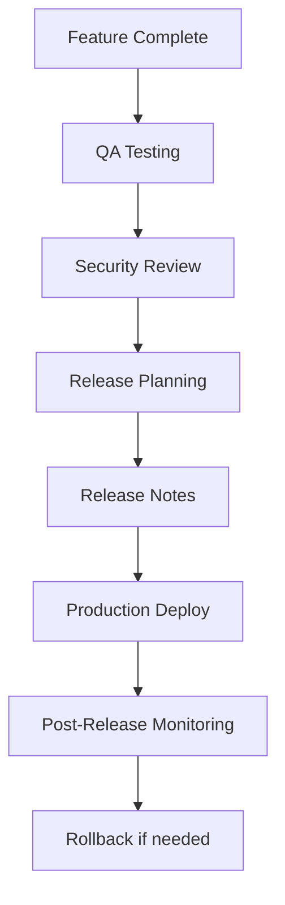
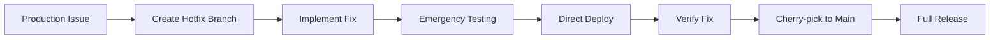

# Release Process

This document outlines the release and deployment processes for the Blueprintify project, ensuring consistent, reliable, and traceable releases.

## 🎯 Release Philosophy

Our release process emphasizes:

- **Automation**: Minimize manual intervention
- **Safety**: Multiple quality gates before production
- **Traceability**: Every change is tracked and documented
- **Rollback Ready**: Quick recovery capabilities
- **Incremental**: Small, frequent releases over large batches

## 📋 Release Types

### 1. Production Releases

Production releases are updates to the live application used by end users.

#### Triggers

- Scheduled monthly releases
- Critical security fixes
- Major feature milestones

#### Process Flow



### 2. Canary Releases

Canary releases deploy changes to a subset of users before full rollout.

#### When to Use

- Major architectural changes
- New AI agent behaviors
- Database schema changes
- Performance-critical updates

#### Canary Strategy

```typescript
// Feature flag configuration
const CANARY_CONFIG = {
  percentage: 0.1, // 10% of users
  criteria: {
    userIdHash: (userId: string) => {
      const hash = crypto.createHash("md5").update(userId).digest("hex");
      return parseInt(hash.substring(0, 8), 16) % 100 < 10;
    },
    allowlist: ["test-user-1", "test-user-2"], // Always include test users
    blocklist: ["enterprise-user-1"], // Exclude specific users
  },
};
```

### 3. Hotfix Releases

Hotfixes address critical production issues that require immediate resolution.

#### Hotflow Process



## 🔄 Release Workflow

### Pre-Release Checklist

Before initiating any release, ensure:

#### Code Quality

- [ ] All tests passing (100% pass rate)
- [ ] Coverage targets met (≥80% overall, ≥95% critical paths)
- [ ] No linting errors or warnings
- [ ] Type checking successful
- [ ] Security scan passed
- [ ] Performance benchmarks met

#### Documentation

- [ ] Release notes drafted
- [ ] API documentation updated
- [ ] User-facing docs updated
- [ ] Technical specifications current
- [ ] Breaking changes documented

#### Deployment Readiness

- [ ] Environment variables verified
- [ ] Database migrations prepared
- [ ] Rollback procedures tested
- [ ] Monitoring dashboards ready
- [ ] Alert thresholds configured
- [ ] Team notified of release window

### Release Preparation

#### 1. Version Management

```bash
# Create release branch from main
git checkout -b release/v1.2.0 main

# Update version numbers
npm version 1.2.0 --no-git-tag-version

# Update all workspace packages
npm workspaces run version 1.2.0

# Commit version changes
git commit -am "chore(release): bump version to 1.2.0"
```

#### 2. Changelog Generation

```typescript
// scripts/generate-changelog.ts
import { execSync } from "child_process";
import { writeFileSync } from "fs";

function generateChangelog(fromTag: string, toTag: string): string {
  const commitRange = `${fromTag}..${toTag}`;
  const commits = execSync(`git log ${commitRange} --pretty=format:"%s|%h|%an|%ad" --date=short`).toString().split("\n").filter(Boolean);

  const changes = commits.map((line) => {
    const [message, hash, author, date] = line.split("|");
    return {
      message,
      hash,
      author,
      date,
      type: message.split(":")[0],
    };
  });

  return formatChangelog(changes);
}
```

#### 3. Release Notes Template

````markdown
# Release v1.2.0

## 🚀 Features

- **Feature description** ([PR #123](../../pull/123))
- **Another feature** ([PR #124](../../pull/124))

## 🐛 Bug Fixes

- **Critical bug fix** ([PR #125](../../pull/125))
- **Minor bug fix** ([PR #126](../../pull/126))

## 🔧 Improvements

- **Performance improvement** ([PR #127](../../pull/127))
- **Code refactoring** ([PR #128](../../pull/128))

## ⚠️ Breaking Changes

- **Breaking change description** - Migration guide below

## 🔄 Deprecations

- **Deprecated feature** - Will be removed in v2.0.0

## 📊 Stats

- **Files changed**: 42
- **Additions**: 1,234
- **Deletions**: 567
- **Test coverage**: 85.2% (+2.1%)

## 🚦 Rollback Instructions

If issues arise, rollback using:

```bash
git checkout v1.1.0
npm run deploy:production
```
````

## 📦 Installation

```bash
npm install @blueprintify/core@1.2.0
```

````

### Deployment Process

#### 1. API Deployment (Cloudflare Workers)

```bash
# Deploy to production
cd apps/api
npm run deploy

# Verify deployment
wrangler tail --format=json

# Test production endpoint
curl https://api.blueprintify.dev/health
````

#### 2. Frontend Deployment

```bash
# Build production assets
cd apps/web
npm run build

# Deploy to production
npm run deploy:production

# Verify deployment
curl https://blueprintify.dev/health
```

#### 3. Database Migrations

```bash
# Run database migrations
npm run migrate:production

# Verify migration status
npm run migrate:status
```

## 🔍 Quality Gates

### Automated Checks

#### 1. Pre-Deploy Validation

```typescript
// scripts/pre-deploy-check.ts
interface PreDeployCheck {
  name: string;
  critical: boolean;
  check: () => Promise<boolean>;
}

const preDeployChecks: PreDeployCheck[] = [
  {
    name: "API Health Check",
    critical: true,
    check: async () => {
      const response = await fetch(`${process.env.API_URL}/health`);
      return response.ok;
    },
  },
  {
    name: "Frontend Build",
    critical: true,
    check: async () => {
      const result = execSync("npm run build", { cwd: "apps/web" });
      return result.exitCode === 0;
    },
  },
  {
    name: "Test Coverage",
    critical: true,
    check: async () => {
      const coverage = await getCoverageReport();
      return coverage.overall >= 80;
    },
  },
  {
    name: "Security Scan",
    critical: true,
    check: async () => {
      const scan = await runSecurityScan();
      return !scan.highSeverityIssues;
    },
  },
];

async function runPreDeployChecks(): Promise<void> {
  for (const check of preDeployChecks) {
    console.log(`Running ${check.name}...`);
    const passed = await check.check();

    if (!passed && check.critical) {
      console.error(`❌ ${check.name} failed - Blocking deployment`);
      process.exit(1);
    }

    console.log(`✅ ${check.name} passed`);
  }
}
```

#### 2. Post-Deploy Validation

```typescript
// scripts/post-deploy-check.ts
const postDeployChecks = {
  // API functionality
  "api-blueprint-generation": async () => {
    const response = await fetch(`${process.env.PROD_API_URL}/generate`, {
      method: "POST",
      headers: { "Content-Type": "application/json" },
      body: JSON.stringify({
        name: "Test Blueprint",
        features: ["basic"],
      }),
    });
    return response.ok;
  },

  // Frontend functionality
  "frontend-rendering": async () => {
    const puppeteer = require("puppeteer");
    const browser = await puppeteer.launch();
    const page = await browser.newPage();

    await page.goto(process.env.PROD_WEB_URL);
    const title = await page.title();

    await browser.close();
    return title.includes("Blueprintify");
  },

  // Performance checks
  "performance-threshold": async () => {
    const lighthouse = require("lighthouse");
    const result = await lighthouse(process.env.PROD_WEB_URL);

    return {
      performance: result.lhr.categories.performance.score * 100,
      accessibility: result.lhr.categories.accessibility.score * 100,
      "best-practices": result.lhr.categories["best-practices"].score * 100,
      seo: result.lhr.categories.seo.score * 100,
    };
  },
};
```

### Manual Review Points

#### 1. Feature Verification

- [ ] All user-facing features working
- [ ] No broken links or missing assets
- [ ] Responsive design on mobile devices
- [ ] Browser compatibility (Chrome, Firefox, Safari, Edge)

#### 2. Performance Verification

- [ ] Page load times under 3 seconds
- [ ] API response times under 500ms
- [ ] No memory leaks detected
- [ ] Bundle size within acceptable limits

#### 3. Security Verification

- [ ] No exposed API keys or secrets
- [ ] Proper authentication/authorization working
- [ ] Input validation effective
- [ ] CORS policies correctly configured

## 📊 Release Monitoring

### Real-time Monitoring

#### 1. Application Performance

```typescript
// monitoring/release-metrics.ts
class ReleaseMonitor {
  private metrics: Map<string, number> = new Map();

  async trackDeployment(deploymentId: string): Promise<void> {
    // Start tracking deployment metrics
    this.metrics.set(`${deploymentId}:start_time`, Date.now());

    // Monitor key metrics
    this.monitorErrorRates(deploymentId);
    this.monitorResponseTimes(deploymentId);
    this.monitorUserSatisfaction(deploymentId);
  }

  private async monitorErrorRates(deploymentId: string): Promise<void> {
    const errorRate = await this.getCurrentErrorRate();
    this.metrics.set(`${deploymentId}:error_rate`, errorRate);

    if (errorRate > 0.05) {
      // 5% error rate threshold
      await this.alertHighErrorRate(deploymentId, errorRate);
    }
  }

  private async monitorResponseTimes(deploymentId: string): Promise<void> {
    const avgResponseTime = await this.getAverageResponseTime();
    this.metrics.set(`${deploymentId}:response_time`, avgResponseTime);

    if (avgResponseTime > 1000) {
      // 1 second threshold
      await this.alertSlowResponse(deploymentId, avgResponseTime);
    }
  }

  async generateReleaseReport(deploymentId: string): Promise<ReleaseReport> {
    const startTime = this.metrics.get(`${deploymentId}:start_time`);
    const endTime = Date.now();

    return {
      deploymentId,
      duration: endTime - (startTime || endTime),
      errorRate: this.metrics.get(`${deploymentId}:error_rate`) || 0,
      avgResponseTime: this.metrics.get(`${deploymentId}:response_time`) || 0,
      userSatisfaction: await this.getUserSatisfactionScore(),
    };
  }
}
```

#### 2. User Experience Monitoring

```typescript
// monitoring/ux-metrics.ts
interface UXMetric {
  timestamp: number;
  userId: string;
  action: string;
  duration: number;
  success: boolean;
  userAgent: string;
}

class UXMonitor {
  trackBlueprintGeneration(userId: string, duration: number, success: boolean): void {
    const metric: UXMetric = {
      timestamp: Date.now(),
      userId,
      action: "blueprint-generation",
      duration,
      success,
      userAgent: navigator.userAgent,
    };

    this.sendMetric(metric);
  }

  async getBlueprintGenerationStats(timeWindow: number): Promise<{
    avgDuration: number;
    successRate: number;
    totalAttempts: number;
  }> {
    const metrics = await this.getMetrics(timeWindow, "blueprint-generation");
    const successful = metrics.filter((m) => m.success);

    return {
      avgDuration: successful.reduce((sum, m) => sum + m.duration, 0) / successful.length,
      successRate: successful.length / metrics.length,
      totalAttempts: metrics.length,
    };
  }
}
```

## 🚨 Incident Response

### Rollback Procedures

#### 1. Automated Rollback

```typescript
// scripts/rollback.ts
class RollbackManager {
  async rollback(deploymentId: string, reason: string): Promise<void> {
    console.log(`Initiating rollback for ${deploymentId}: ${reason}`);

    try {
      // 1. Mark deployment as failed
      await this.markDeploymentFailed(deploymentId, reason);

      // 2. Rollback API to previous version
      await this.rollbackAPI();

      // 3. Rollback frontend to previous version
      await this.rollbackFrontend();

      // 4. Verify rollback success
      await this.verifyRollback();

      // 5. Notify team
      await this.notifyRollbackComplete(deploymentId);
    } catch (error) {
      console.error("Rollback failed:", error);
      await this.notifyRollbackFailed(deploymentId, error);
      throw error;
    }
  }

  private async rollbackAPI(): Promise<void> {
    const previousVersion = await this.getPreviousAPIVersion();
    execSync(`wrangler deploy --compatibility-date 2023-05-18 --version ${previousVersion}`);
  }

  private async rollbackFrontend(): Promise<void> {
    const previousVersion = await this.getPreviousFrontendVersion();
    execSync(`git checkout ${previousVersion} && npm run deploy:production`);
  }
}
```

#### 2. Manual Rollback Steps

```bash
# 1. Identify last known good version
git log --oneline -10

# 2. Rollback API
cd apps/api
wrangler rollback --compatibility-date 2023-05-18

# 3. Rollback Frontend
cd apps/web
git checkout <previous-stable-commit>
npm run build
npm run deploy:production

# 4. Verify rollback
curl -f https://api.blueprintify.dev/health
curl -f https://blueprintify.dev/health
```

### Post-Incident Analysis

#### 1. Incident Report Template

```markdown
# Incident Report: [Title]

## Summary

- **Date**: [Date/Time of incident]
- **Duration**: [Start to resolution time]
- **Impact**: [Number of users affected, severity level]
- **Root Cause**: [Primary cause of the incident]

## Timeline

- **HH:MM**: Incident detected
- **HH:MM**: Alert triggered
- **HH:MM**: Investigation started
- **HH:MM**: Root cause identified
- **HH:MM**: Rollback initiated
- **HH:MM**: Service restored
- **HH:MM**: Post-mortem started

## Root Cause Analysis

### What happened

[Detailed description of the incident]

### Why it happened

[Technical and process factors that contributed]

### Contributing factors

[Secondary factors that made the incident worse]

## Resolution Steps

1. [Immediate action taken]
2. [Follow-up actions]
3. [Long-term fixes]

## Impact Assessment

- **User Impact**: [Description]
- **Business Impact**: [Description]
- **Technical Impact**: [Description]

## Lessons Learned

- **What went well**: [Positive aspects of response]
- **What could be improved**: [Areas for improvement]
- **Action items**: [Specific improvements to implement]

## Prevention Measures

1. [Short-term prevention]
2. [Long-term prevention]
3. [Monitoring improvements]

## Follow-up Tasks

- [ ] Task 1 - [Owner] - [Due Date]
- [ ] Task 2 - [Owner] - [Due Date]
- [ ] Task 3 - [Owner] - [Due Date]
```

## 📅 Release Schedule

### Regular Release Cadence

#### Monthly Production Releases

- **Date**: First Monday of each month
- **Deadline**: Code freeze 3 days prior
- **Testing window**: 2 days before release
- **Release time**: 10:00 AM UTC

#### Weekly Staging Releases

- **Date**: Every Wednesday
- **Purpose**: Staging environment updates
- **Testing**: Full QA and security review
- **Rollback**: Allowed any time

#### Daily Development Releases

- **Frequency**: As needed
- **Environment**: Development/staging only
- **Testing**: Automated tests only
- **Purpose**: Feature validation

### Release Calendar Integration

```typescript
// scripts/release-scheduler.ts
class ReleaseScheduler {
  async scheduleReleases(): Promise<ReleaseSchedule> {
    const today = new Date();
    const thisMonth = new Date(today.getFullYear(), today.getMonth(), 1);
    const nextMonth = new Date(today.getFullYear(), today.getMonth() + 1, 1);

    return {
      currentMonth: {
        productionRelease: this.getFirstMonday(thisMonth),
        codeFreeze: new Date(thisMonth.setDate(thisMonth.getDate() - 3)),
        testingWindow: {
          start: new Date(thisMonth.setDate(thisMonth.getDate() - 2)),
          end: new Date(thisMonth.setDate(thisMonth.getDate() - 1)),
        },
      },
      nextMonth: {
        productionRelease: this.getFirstMonday(nextMonth),
        codeFreeze: new Date(nextMonth.setDate(nextMonth.getDate() - 3)),
      },
    };
  }

  private getFirstMonday(date: Date): Date {
    const firstDay = new Date(date.getFullYear(), date.getMonth(), 1);
    const dayOfWeek = firstDay.getDay();
    const daysUntilMonday = dayOfWeek === 0 ? 1 : 8 - dayOfWeek;

    return new Date(firstDay.setDate(firstDay.getDate() + daysUntilMonday));
  }
}
```

## 🔐 Security Release Process

### Security Vulnerability Response

#### 1. Vulnerability Discovery

```typescript
// security/vulnerability-handler.ts
interface Vulnerability {
  id: string;
  severity: "critical" | "high" | "medium" | "low";
  description: string;
  affectedVersions: string[];
  discoveredAt: Date;
  discoveredBy: string;
  confidential: boolean;
}

class VulnerabilityHandler {
  async handleVulnerability(vulnerability: Vulnerability): Promise<void> {
    // 1. Assess severity and impact
    const impact = await this.assessImpact(vulnerability);

    // 2. Determine response timeline
    const timeline = this.getResponseTimeline(vulnerability.severity);

    // 3. Create security advisory
    await this.createSecurityAdvisory(vulnerability, impact);

    // 4. Coordinate fix development
    await this.coordinateFix(vulnerability, timeline);

    // 5. Plan security release
    await this.planSecurityRelease(vulnerability);
  }

  private getResponseTimeline(severity: string): {
    fixBy: Date;
    discloseBy: Date;
  } {
    const now = new Date();

    switch (severity) {
      case "critical":
        return {
          fixBy: new Date(now.getTime() + 24 * 60 * 60 * 1000), // 24 hours
          discloseBy: new Date(now.getTime() + 48 * 60 * 60 * 1000), // 48 hours
        };
      case "high":
        return {
          fixBy: new Date(now.getTime() + 72 * 60 * 60 * 1000), // 72 hours
          discloseBy: new Date(now.getTime() + 7 * 24 * 60 * 60 * 1000), // 7 days
        };
      default:
        return {
          fixBy: new Date(now.getTime() + 14 * 24 * 60 * 60 * 1000), // 14 days
          discloseBy: new Date(now.getTime() + 30 * 24 * 60 * 60 * 1000), // 30 days
        };
    }
  }
}
```

---

_Release processes are continuously evolving. Last updated: 2026-02-19_
