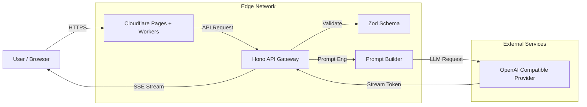

# Blueprint Generator - Product Plan & Architecture

**Status**: Draft
**Version**: 1.0.0
**Author**: Agent 00 (Product Strategist)

## 1. Executive Summary

The **Blueprint Generator** is a web-based application designed to solve the "Cold Start" problem in autonomous development. It acts as an intelligent bridge between raw intentions (or existing code) and the structured documentation (`blueprint.md`, `task.md`) required by autonomous agents.

Hosted on **Cloudflare**, it leverages the massive scalability of Edge Workers and OpenAI-compatible AI engines to generate high-quality architectural documentation in seconds.

## 2. Core Vision

To provide a friction-less "Day 1" experience for projects using the Agent System. Users should be able to go from "Idea" to "Ready-to-Code" in under 2 minutes.

## 3. Architecture & Tech Stack

We will utilize the full **Cloudflare Ecosystem** for maximum performance, low latency, and type safety.

### 3.1. Infrastructure (The "Cloudflare Stack")

- **Runtime**: **Cloudflare Workers** (Serverless, Edge-first).
- **Frontend Hosting**: **Cloudflare Pages** (Global CDN).
- **Database (Optional)**: **Cloudflare D1** (SQLite) - _Reserved for saving user project history if needed in Phase 2._
- **Storage (Optional)**: **Cloudflare KV** - _For caching AI responses or session templates._

### 3.2. Application Stack

- **Language**: **TypeScript** (Strict, End-to-End type safety).
- **Backend Framework**: **Hono**
  - Why? Ultra-lightweight (perfect for Workers), robust routing, top-tier TypeScript support, Zod validation built-in.
- **Frontend Framework**: **React + Vite**
  - Modern, fast, and familiar.
  - Styling: **Tailwind CSS** (for rapid, premium UI).
  - State Management: **Zustand** or React Context.
- **AI Engine**: **OpenAI Compatible Client**
  - Wrapper around `fetch` or `openai-node` (edge compatible).
  - Design robust prompts to act as the "Senior Architect".

### 3.3. Architecture Diagram



## 4. Developer Specifications & User Stories

As a developer, I need clear requirements to build against.

### 4.1. User Stories

#### Epics: The "Zero-to-One" Experience

- **US-1: Project Initialization**

  - _As a_ user starting a new project,
  - _I want to_ input my project name, description, and select my tech stack (e.g., React, Hono, Supabase) via a wizard,
  - _So that_ the system understands my architectural constraints.

- **US-2: Blueprint Generation**

  - _As a_ user,
  - _I want to_ click "Generate Blueprint" and see a real-time stream of the `blueprint.md` content,
  - _So that_ I don't have to wait 30 seconds for a blank screen and can verify the AI's "thought process".

- **US-3: Task Breakdown**

  - _As a_ user,
  - _I want the_ system to automatically generate a `task.md` with P0/P1 priorities based on the generated blueprint,
  - _So that_ I have an immediate actionable checklist.

- **US-4: Export/Download**
  - _As a_ user,
  - _I want to_ download a `.zip` file containing the generated `.docs/` folder,
  - _So that_ I can unzip it into my project root and start coding immediately.

#### Technical Stories (Non-Functional)

- **TS-1: Edge Compatibility**

  - The backend MUST run on Cloudflare Workers (0ms cold start).
  - Dependencies must be strictly ESM and lightweight (avoid heavy Node.js built-ins).

- **TS-2: Type Safety**
  - Shared Zod schemas between Frontend and Backend to ensure API contract validity.

### 4.2. Refined Project Structure (Monorepo-style)

```text
blueprint-generator/
├── package.json          # Workspace root
├── packages/
│   └── shared/           # Shared Types & Zod Schemas
│       ├── src/
│       │   ├── schema.ts # Zod definitions (BlueprintRequest, etc.)
│       │   └── types.ts  # Ts types inferred from Zod
├── apps/
│   ├── api/              # Hono Backend (Cloudflare Worker)
│   │   ├── src/
│   │   │   ├── index.ts  # Entry point & Routes
│   │   │   ├── services/ # OpenAI, PromptBuilder
│   │   │   └── utils/    # Stream handlers
│   │   └── wrangler.toml
│   └── web/              # React Frontend (Vite)
│       ├── src/
│       │   ├── components/
│       │   ├── hooks/    # Custom hook for SSE streaming
│       │   └── lib/      # API client (typesafe)
│       └── vite.config.ts
```

### 4.3. refined Tech Stack Details

- **Backend (Hono)**:
  - Middleware: `cors`, `prettyJSON`, `zod-validator`.
  - AI Client: `openai` (Official SDK now supports Edge/Workers) OR `fetch` wrapper if SDK is too heavy (check bundle size).
- **Frontend (React)**:
  - **Tailwind CSS** + **Radix UI** (for accessible primitives like Dialogs, Selects).
  - **Framer Motion** (for smooth step transitions in the wizard).
  - **highlight.js** or **prismjs** (for rendering the Markdown preview).

### 4.4. Enhanced Feature Set (Gap Analysis)

Upon final review, the following features are critical for a complete developer experience:

- **EF-1: The "Refinement Loop" (Edit & Regenerate)**

  - _Problem_: AI generation is rarely perfect on the first try.
  - _Solution_: A split-view interface.
    - **Left**: The generative wizard/chat.
    - **Right**: A live internal code editor (Monaco or CodeMirror) where users can manually tweak the generated markdown.
  - _Feature_: "Regenerate Selection" - User highlights a section of the blueprint and asks AI to "Retry this part with more detail".

- **EF-2: Template Library (Quick Start)**

  - _Problem_: "Blank page syndrome" when the wizard asks "What do you want to build?".
  - _Solution_: A card grid of starter templates.
    - "Next.js SaaS Boilerplate"
    - "Hono + Cloudflare Worker API"
    - "Chrome Extension"
    - "CLI Tool"
  - Clicking a template pre-fills the wizard with verified best practices.

- **EF-3: Session Persistence (Safety)**

  - _Problem_: Browser refresh kills the generated content.
  - _Solution_: Auto-save drafts to `localStorage`. Restore session on return.

- **EF-4: "Smart Copy" & format**
  - _Feature_: "Copy Blueprint" and "Copy Tasks" buttons that format the text specifically for pasting into the IDE (e.g., ensuring correct newlines).

## 5. Implementation Roadmap

### Step 1: Foundation Setup

- [ ] Initialize NPM Workspace (`npm init -y -w`).
- [ ] Create `packages/shared`, `apps/api`, `apps/web`.
- [ ] Setup TSConfig references for monorepo.
- [ ] Setup **Monaco Editor** or **CodeMirror** in the frontend structure.

### Step 2: The Core API (Backend)

- [ ] Implement `POST /generate` endpoint in Hono.
- [ ] Setup Zod validation for inputs (stack, description, etc.).
- [ ] Implement SSE (Server-Sent Events) helper for streaming LLM tokens to client.

### Step 3: Prompt Engineering

- [ ] Design the "System Prompt" that enforces the Agent00 persona.
- [ ] specific instructions: "You are the Architect. Output ONLY valid markdown."
- [ ] Create prompt templates for:
  - `BlueprintGenerator`: Creating the architecture doc.
  - `TaskSplitter`: Breaking user stories into technical tasks.
  - `Refiner`: "Rewrite this specific section".

### Step 4: The Frontend Experience

- [ ] Build the "Wizard" state machine (Step 1: Info -> Step 2: Stack -> Step 3: Review).
- [ ] Implement **Split-Pane Layout** (Wizard Left, Editor Right).
- [ ] Integrate **CodeMirror** for syntax-highlighted editing.
- [ ] Implement `useLocalStorage` for session persistence.
- [ ] Add "Download" functionality (Client-side Zip generation using `jszip`).

## 6. Development Guidelines

- **Type Safety**: Shared `types` package between Backend and Frontend (Monorepo structure optional but recommended for shared types).
- **Privacy**: Do not store user prompts unless explicitly opted-in.
- **Performance**: The API response must start streaming < 2s.

## 7. Next Steps for Execution

1.  Confirm this plan.
2.  Initialize the repository structure.
3.  Setup the Cloudflare Hono starter.
